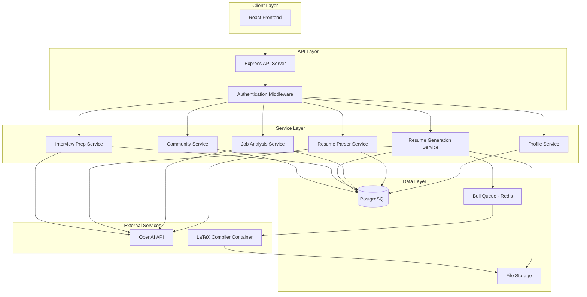

# Design Document

## Overview

The ATS Resume Builder is a full-stack web application that helps job seekers create optimized resumes tailored to specific job descriptions. The system combines AI-powered content optimization, LaTeX-based PDF generation, and community-driven interview intelligence to provide a comprehensive job application platform.

The application follows a three-tier architecture with a React frontend, Node.js/Express backend, and PostgreSQL database. Resume generation is handled asynchronously using a job queue system, and LaTeX compilation runs in isolated Docker containers for security.

## Architecture

### High-Level Architecture



### Technology Stack

**Frontend:**
- React 18 with TypeScript
- React Router for navigation
- Axios for HTTP requests
- Tailwind CSS for styling
- React Hook Form for form management
- React Query for server state management

**Backend:**
- Node.js 20+ with Express.js
- TypeScript for type safety
- Prisma ORM for database access
- JWT for authentication
- Bull/BullMQ for job queue
- Multer for file uploads
- pdf-parse for PDF parsing
- mammoth for DOCX parsing

**Database:**
- PostgreSQL 15+ for relational data
- Redis for queue and caching

**Infrastructure:**
- Docker for LaTeX compilation containers
- Docker Compose for local development
- Environment-based configuration

## Components and Interfaces

### Frontend Components

#### 1. Authentication Module
- **LoginPage**: User login form with email/password
- **RegisterPage**: New user registration
- **AuthContext**: Global authentication state management
- **ProtectedRoute**: Route wrapper for authenticated pages

#### 2. Profile Management Module
- **ProfileDashboard**: Overview of user profile
- **WorkExperienceForm**: Add/edit work experience entries
- **EducationForm**: Add/edit education entries
- **SkillsManager**: Add/edit/categorize skills
- **ProjectsForm**: Add/edit project entries
- **ResumeUploader**: Upload and parse existing resumes
- **ParsedDataReview**: Review and edit extracted resume data

#### 3. Resume Generation Module
- **JobDescriptionInput**: Text area for job description
- **JobAnalysisView**: Display extracted requirements and matching score
- **TemplateSelector**: Gallery of LaTeX templates with previews
- **ResumeGenerator**: Trigger resume generation
- **ATSScoreDisplay**: Show ATS score with breakdown
- **ResumePreview**: PDF preview of generated resume
- **ResumeDownload**: Download button with file naming

#### 4. Resume History Module
- **ResumeHistoryList**: List of previously generated resumes
- **ResumeHistoryItem**: Individual resume card with metadata
- **ResumeDetailView**: Detailed view of a specific resume

#### 5. Interview Preparation Module
- **InterviewQuestionsView**: Display generated interview questions
- **QuestionCategory**: Grouped questions by category
- **AnswerFramework**: Suggested answer structure for each question

#### 6. Community Platform Module
- **InterviewExperienceForm**: Submit interview experience
- **CompanySearch**: Search for company interview data
- **InterviewInsightsView**: Aggregated interview data display
- **ProcessTimeline**: Visual representation of interview rounds
- **QuestionsList**: Community-submitted questions
- **TipsAndInsights**: Success tips and difficulty ratings

### Backend API Endpoints

#### Authentication API (`/api/auth`)
```typescript
POST   /api/auth/register
POST   /api/auth/login
POST   /api/auth/logout
GET    /api/auth/me
POST   /api/auth/refresh
```

#### Profile API (`/api/profile`)
```typescript
GET    /api/profile
PUT    /api/profile

// Work Experience
GET    /api/profile/experience
POST   /api/profile/experience
PUT    /api/profile/experience/:id
DELETE /api/profile/experience/:id

// Education
GET    /api/profile/education
POST   /api/profile/education
PUT    /api/profile/education/:id
DELETE /api/profile/education/:id

// Skills
GET    /api/profile/skills
POST   /api/profile/skills
PUT    /api/profile/skills/:id
DELETE /api/profile/skills/:id

// Projects
GET    /api/profile/projects
POST   /api/profile/projects
PUT    /api/profile/projects/:id
DELETE /api/profile/projects/:id
```

#### Upload API (`/api/upload`)
```typescript
POST   /api/upload/resume          // Upload and parse resume
GET    /api/upload/parsed/:id      // Get parsed data for review
POST   /api/upload/confirm/:id     // Confirm and save parsed data
```

#### Job Description API (`/api/jobs`)
```typescript
POST   /api/jobs/analyze           // Analyze job description
GET    /api/jobs/:id               // Get saved job description
GET    /api/jobs                   // List user's job descriptions
DELETE /api/jobs/:id               // Delete job description
```

#### Resume API (`/api/resume`)
```typescript
POST   /api/resume/generate        // Generate resume (async)
GET    /api/resume/status/:jobId   // Check generation status
GET    /api/resume/:id             // Get resume metadata
GET    /api/resume/:id/download    // Download PDF
GET    /api/resume                 // List user's resumes
POST   /api/resume/:id/regenerate  // Regenerate with updated data
DELETE /api/resume/:id             // Delete resume
```

#### Template API (`/api/templates`)
```typescript
GET    /api/templates              // List available templates
GET    /api/templates/:id          // Get template details
GET    /api/templates/:id/preview  // Get template preview image
```

#### Interview API (`/api/interview`)
```typescript
GET    /api/interview/questions/:resumeId  // Get interview questions
POST   /api/interview/experience           // Submit interview experience
GET    /api/interview/insights             // Search company insights
GET    /api/interview/insights/:company/:role  // Get specific insights
```

### Service Layer Interfaces

#### ProfileService
```typescript
interface ProfileService {
  getUserProfile(userId: string): Promise<UserProfile>;
  updateProfile(userId: string, data: ProfileUpdate): Promise<UserProfile>;
  
  // Work Experience
  addWorkExperience(userId: string, data: WorkExperienceInput): Promise<WorkExperience>;
  updateWorkExperience(id: string, data: WorkExperienceInput): Promise<WorkExperience>;
  deleteWorkExperience(id: string): Promise<void>;
  
  // Similar methods for Education, Skills, Projects
}
```

#### ResumeParserService
```typescript
interface ResumeParserService {
  parseResume(file: Buffer, fileType: 'pdf' | 'docx'): Promise<ParsedResumeData>;
  extractText(file: Buffer, fileType: 'pdf' | 'docx'): Promise<string>;
  structureData(text: string): Promise<ParsedResumeData>;
}
```

#### JobAnalysisService
```typescript
interface JobAnalysisService {
  analyzeJobDescription(text: string): Promise<JobAnalysis>;
  extractRequirements(text: string): Promise<Requirement[]>;
  matchProfile(profile: UserProfile, jobAnalysis: JobAnalysis): Promise<MatchResult>;
  calculateRelevanceScores(profile: UserProfile, requirements: Requirement[]): Promise<RelevanceScore[]>;
}
```

#### ResumeGenerationService
```typescript
interface ResumeGenerationService {
  generateResume(userId: string, jobId: string, templateId: string): Promise<string>; // Returns job ID
  selectRelevantContent(profile: UserProfile, jobAnalysis: JobAnalysis): Promise<SelectedContent>;
  optimizeContent(content: SelectedContent, requirements: Requirement[]): Promise<OptimizedContent>;
  compileLatex(template: string, data: OptimizedContent): Promise<Buffer>;
  calculateATSScore(resume: OptimizedContent, jobAnalysis: JobAnalysis): Promise<ATSScore>;
}
```

#### InterviewPrepService
```typescript
interface InterviewPrepService {
  generateQuestions(resume: Resume, jobDescription: JobDescription): Promise<InterviewQuestion[]>;
  categorizeQuestions(questions: InterviewQuestion[]): Promise<CategorizedQuestions>;
  generateAnswerFrameworks(questions: InterviewQuestion[], profile: UserProfile): Promise<AnswerFramework[]>;
}
```

#### CommunityService
```typescript
interface CommunityService {
  submitExperience(data: InterviewExperienceInput): Promise<InterviewExperience>;
  anonymizeExperience(data: InterviewExperienceInput): Promise<AnonymizedExperience>;
  getCompanyInsights(company: string, role: string): Promise<CompanyInsights>;
  aggregateExperiences(experiences: InterviewExperience[]): Promise<AggregatedInsights>;
}
```

## Data Models

### User and Authentication

```typescript
interface User {
  id: string;
  email: string;
  passwordHash: string;
  firstName: string;
  lastName: string;
  createdAt: Date;
  updatedAt: Date;
}

interface Session {
  id: string;
  userId: string;
  token: string;
  expiresAt: Date;
  createdAt: Date;
}
```

### Profile Data

```typescript
interface WorkExperience {
  id: string;
  userId: string;
  company: string;
  position: string;
  startDate: Date;
  endDate: Date | null; // null for current position
  description: string;
  achievements: string[];
  technologies: string[];
  order: number;
  createdAt: Date;
  updatedAt: Date;
}

interface Education {
  id: string;
  userId: string;
  institution: string;
  degree: string;
  fieldOfStudy: string;
  startDate: Date;
  endDate: Date | null;
  gpa: number | null;
  achievements: string[];
  order: number;
  createdAt: Date;
  updatedAt: Date;
}

interface Skill {
  id: string;
  userId: string;
  name: string;
  category: string; // 'technical', 'soft', 'language', etc.
  proficiency: string; // 'beginner', 'intermediate', 'advanced', 'expert'
  yearsOfExperience: number | null;
  order: number;
  createdAt: Date;
  updatedAt: Date;
}

interface Project {
  id: string;
  userId: string;
  title: string;
  description: string;
  technologies: string[];
  url: string | null;
  githubUrl: string | null;
  startDate: Date | null;
  endDate: Date | null;
  highlights: string[];
  order: number;
  createdAt: Date;
  updatedAt: Date;
}
```

### Job and Resume Data

```typescript
interface JobDescription {
  id: string;
  userId: string;
  company: string;
  position: string;
  rawText: string;
  analyzedData: JobAnalysis;
  createdAt: Date;
  updatedAt: Date;
}

interface JobAnalysis {
  requirements: Requirement[];
  skills: string[];
  experienceLevel: string;
  keywords: string[];
  companyInfo: string;
}

interface Requirement {
  text: string;
  category: 'required' | 'preferred';
  type: 'skill' | 'experience' | 'education' | 'certification';
  importance: number; // 0-1 score
}

interface Resume {
  id: string;
  userId: string;
  jobDescriptionId: string;
  templateId: string;
  fileName: string;
  filePath: string;
  atsScore: ATSScore;
  generatedContent: OptimizedContent;
  status: 'pending' | 'processing' | 'completed' | 'failed';
  createdAt: Date;
  updatedAt: Date;
}

interface ATSScore {
  overall: number; // 0-100
  breakdown: {
    keywordMatch: number;
    experienceRelevance: number;
    formatParseability: number;
    educationMatch: number;
  };
  missingKeywords: string[];
  suggestions: string[];
}

interface OptimizedContent {
  personalInfo: {
    name: string;
    email: string;
    phone: string;
    location: string;
    linkedin: string | null;
    github: string | null;
    website: string | null;
  };
  summary: string;
  experience: WorkExperience[];
  education: Education[];
  skills: Skill[];
  projects: Project[];
}
```

### Interview Data

```typescript
interface InterviewQuestion {
  id: string;
  resumeId: string;
  question: string;
  category: 'technical' | 'behavioral' | 'experience' | 'role-specific';
  difficulty: 'easy' | 'medium' | 'hard';
  relatedContent: string; // Reference to resume content
  answerFramework: string | null;
  talkingPoints: string[];
  createdAt: Date;
}

interface InterviewExperience {
  id: string;
  userId: string; // For tracking, but anonymized in public view
  company: string;
  role: string;
  interviewDate: Date;
  outcome: 'offer' | 'rejected' | 'pending' | 'withdrew';
  overallDifficulty: 'easy' | 'medium' | 'hard';
  rounds: InterviewRound[];
  preparationTips: string[];
  isAnonymous: boolean;
  createdAt: Date;
  updatedAt: Date;
}

interface InterviewRound {
  id: string;
  experienceId: string;
  roundNumber: number;
  roundType: 'phone-screen' | 'technical' | 'system-design' | 'behavioral' | 'cultural-fit' | 'take-home' | 'onsite';
  duration: number; // minutes
  difficulty: 'easy' | 'medium' | 'hard';
  topics: string[];
  questions: string[];
  notes: string;
}

interface CompanyInsights {
  company: string;
  role: string;
  totalSubmissions: number;
  lastUpdated: Date;
  processStructure: {
    averageRounds: number;
    commonRoundTypes: { type: string; frequency: number }[];
    averageDuration: number; // days from first to last round
  };
  commonQuestions: { question: string; frequency: number; category: string }[];
  topicFrequency: { topic: string; frequency: number }[];
  difficultyDistribution: { easy: number; medium: number; hard: number };
  successTips: string[];
}
```

### Template Data

```typescript
interface Template {
  id: string;
  name: string;
  description: string;
  category: 'modern' | 'classic' | 'creative' | 'academic' | 'technical';
  previewImageUrl: string;
  latexContent: string;
  variables: string[]; // List of template variables
  isActive: boolean;
  createdAt: Date;
  updatedAt: Date;
}
```

## Error Handling

### Error Response Format

All API errors follow a consistent format:

```typescript
interface ErrorResponse {
  success: false;
  error: {
    code: string;
    message: string;
    details?: any;
  };
}
```

### Error Categories

**Authentication Errors (401)**
- `AUTH_INVALID_CREDENTIALS`: Invalid email or password
- `AUTH_TOKEN_EXPIRED`: JWT token has expired
- `AUTH_TOKEN_INVALID`: JWT token is malformed or invalid
- `AUTH_UNAUTHORIZED`: User not authorized for this resource

**Validation Errors (400)**
- `VALIDATION_FAILED`: Input validation failed
- `INVALID_FILE_TYPE`: Uploaded file type not supported
- `FILE_TOO_LARGE`: Uploaded file exceeds size limit
- `INVALID_DATE_RANGE`: Start date is after end date

**Resource Errors (404)**
- `RESOURCE_NOT_FOUND`: Requested resource does not exist
- `USER_NOT_FOUND`: User account not found
- `RESUME_NOT_FOUND`: Resume not found

**Processing Errors (500)**
- `RESUME_PARSE_FAILED`: Failed to parse uploaded resume
- `LATEX_COMPILATION_FAILED`: LaTeX compilation error
- `AI_SERVICE_ERROR`: OpenAI API error
- `DATABASE_ERROR`: Database operation failed

**Rate Limiting (429)**
- `RATE_LIMIT_EXCEEDED`: Too many requests

### Error Handling Strategy

1. **Frontend**: Display user-friendly error messages with recovery actions
2. **Backend**: Log detailed errors with context for debugging
3. **Validation**: Validate input at both frontend and backend
4. **Graceful Degradation**: Provide fallback options when services fail
5. **Retry Logic**: Implement exponential backoff for transient failures

## Testing Strategy

### Unit Testing

**Backend Services**
- Test each service method in isolation
- Mock external dependencies (database, OpenAI API, LaTeX compiler)
- Test edge cases and error conditions
- Target: 80% code coverage for service layer

**Frontend Components**
- Test component rendering and user interactions
- Mock API calls and context providers
- Test form validation and error states
- Use React Testing Library

### Integration Testing

**API Endpoints**
- Test complete request/response cycles
- Use test database with seed data
- Test authentication and authorization
- Test file upload and processing flows

**Resume Generation Pipeline**
- Test end-to-end resume generation
- Mock LaTeX compilation for speed
- Verify ATS score calculation
- Test queue processing

### End-to-End Testing

**Critical User Flows**
- User registration and login
- Profile creation and resume upload
- Job description analysis and resume generation
- Resume download and history viewing
- Interview experience submission and viewing

**Tools**
- Playwright or Cypress for E2E tests
- Run against staging environment
- Test on multiple browsers

### Performance Testing

**Load Testing**
- Simulate concurrent users
- Test resume generation under load
- Monitor database query performance
- Test queue processing capacity

**Metrics to Monitor**
- API response times (target: < 200ms for most endpoints)
- Resume generation time (target: < 30 seconds)
- Database query times
- Memory usage and CPU utilization

### Security Testing

**Authentication & Authorization**
- Test JWT token validation
- Test unauthorized access attempts
- Test password hashing and validation

**Input Validation**
- Test SQL injection prevention
- Test XSS prevention
- Test file upload security (malicious files)
- Test LaTeX injection prevention

**Data Privacy**
- Verify data encryption at rest
- Test anonymization of interview experiences
- Verify user data isolation

## Security Considerations

### Authentication & Authorization

1. **Password Security**
   - Use bcrypt with salt rounds >= 10
   - Enforce minimum password requirements (8+ chars, mixed case, numbers)
   - Implement password reset with time-limited tokens

2. **JWT Tokens**
   - Short-lived access tokens (15 minutes)
   - Longer-lived refresh tokens (7 days)
   - Store refresh tokens securely (httpOnly cookies)
   - Implement token rotation

3. **Session Management**
   - Invalidate tokens on logout
   - Implement concurrent session limits
   - Track active sessions per user

### Data Security

1. **Encryption**
   - Encrypt sensitive data at rest (AES-256)
   - Use HTTPS for all communications
   - Encrypt database backups

2. **Input Validation**
   - Validate all user inputs on backend
   - Sanitize inputs to prevent XSS
   - Use parameterized queries to prevent SQL injection
   - Validate file types and sizes

3. **File Upload Security**
   - Scan uploaded files for malware
   - Restrict file types (PDF, DOCX only)
   - Limit file sizes (max 10MB)
   - Store files outside web root
   - Generate unique filenames

### LaTeX Compilation Security

1. **Sandboxing**
   - Run LaTeX compilation in isolated Docker containers
   - Limit container resources (CPU, memory, disk)
   - Use read-only filesystem where possible
   - Disable network access in containers

2. **Input Sanitization**
   - Escape special LaTeX characters
   - Whitelist allowed LaTeX commands
   - Prevent file inclusion attacks
   - Timeout long-running compilations (max 30 seconds)

### API Security

1. **Rate Limiting**
   - Implement per-user rate limits
   - Stricter limits for expensive operations (resume generation)
   - Use Redis for distributed rate limiting

2. **CORS**
   - Configure CORS to allow only frontend domain
   - Validate Origin header

3. **Request Validation**
   - Validate request body schemas
   - Limit request body sizes
   - Validate content types

### Privacy

1. **Data Minimization**
   - Collect only necessary user data
   - Provide data export functionality
   - Implement data deletion (GDPR compliance)

2. **Anonymization**
   - Remove PII from interview experiences
   - Aggregate data before display
   - Hash user IDs in analytics

3. **Access Control**
   - Users can only access their own data
   - Implement role-based access control (RBAC) for admin features
   - Log access to sensitive data

## Performance Optimization

### Database Optimization

1. **Indexing**
   - Index foreign keys
   - Index frequently queried columns (userId, email, company, role)
   - Composite indexes for common query patterns

2. **Query Optimization**
   - Use eager loading to prevent N+1 queries
   - Implement pagination for large result sets
   - Use database views for complex aggregations

3. **Connection Pooling**
   - Configure appropriate pool size
   - Monitor connection usage
   - Implement connection timeout

### Caching Strategy

1. **Redis Caching**
   - Cache compiled LaTeX templates (1 hour TTL)
   - Cache job analysis results (24 hour TTL)
   - Cache company insights (1 hour TTL)
   - Implement cache invalidation on updates

2. **HTTP Caching**
   - Set appropriate Cache-Control headers
   - Use ETags for conditional requests
   - Cache static assets (templates, images)

### Async Processing

1. **Job Queue**
   - Use Bull/BullMQ for resume generation
   - Implement job priorities
   - Configure retry logic with exponential backoff
   - Monitor queue health and length

2. **Background Tasks**
   - Process resume parsing asynchronously
   - Generate interview questions in background
   - Aggregate community insights periodically

### Frontend Optimization

1. **Code Splitting**
   - Lazy load routes
   - Split vendor bundles
   - Use dynamic imports for heavy components

2. **Asset Optimization**
   - Compress images
   - Minify CSS and JavaScript
   - Use CDN for static assets

3. **State Management**
   - Use React Query for server state caching
   - Implement optimistic updates
   - Debounce search inputs

## Deployment Architecture

### Development Environment

```
- Docker Compose setup
- PostgreSQL container
- Redis container
- LaTeX compiler container
- Hot reload for frontend and backend
```

### Production Environment

```
- Frontend: Vercel or Netlify
- Backend: AWS ECS or DigitalOcean App Platform
- Database: AWS RDS PostgreSQL or managed PostgreSQL
- Redis: AWS ElastiCache or managed Redis
- File Storage: AWS S3 or DigitalOcean Spaces
- LaTeX Compilation: AWS Lambda or containerized workers
```

### CI/CD Pipeline

1. **Build**
   - Run linters and formatters
   - Compile TypeScript
   - Build frontend bundle

2. **Test**
   - Run unit tests
   - Run integration tests
   - Generate coverage reports

3. **Deploy**
   - Deploy to staging environment
   - Run E2E tests
   - Deploy to production (manual approval)

### Monitoring

1. **Application Monitoring**
   - Error tracking (Sentry)
   - Performance monitoring (New Relic or DataDog)
   - Uptime monitoring (Pingdom)

2. **Logging**
   - Structured logging (Winston or Pino)
   - Centralized log aggregation (ELK stack or CloudWatch)
   - Log retention policy

3. **Metrics**
   - API response times
   - Resume generation success rate
   - Queue processing times
   - Database query performance
   - User engagement metrics

## Future Enhancements

1. **Multi-language Support**: Generate resumes in multiple languages
2. **Cover Letter Generation**: AI-powered cover letter creation
3. **Application Tracking**: Track job applications and responses
4. **Resume Analytics**: A/B testing different resume versions
5. **Mobile App**: Native mobile applications
6. **Integration with Job Boards**: Direct application submission
7. **AI Interview Practice**: Mock interview with AI feedback
8. **Skill Gap Analysis**: Identify missing skills for target roles
9. **Salary Insights**: Salary recommendations based on profile
10. **Referral Network**: Connect users for referrals
