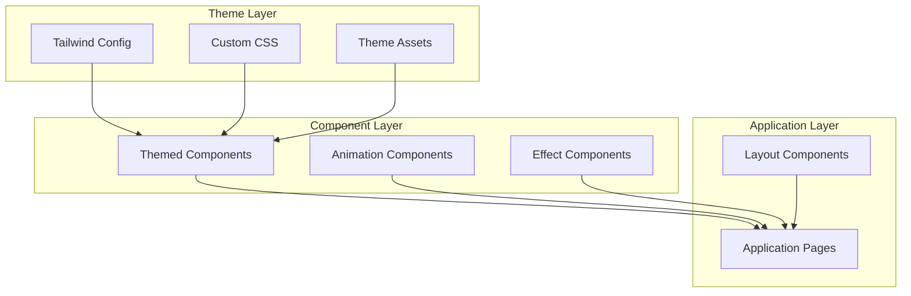

# Design Document

## Overview

The Gengar Ghost-Type Theme is a comprehensive visual redesign of the ATS Resume Builder that applies Pokémon-inspired styling with Gengar as the central character. The theme uses a moderate approach - professional enough for a resume builder while clearly embracing ghost-type aesthetics through colors, animations, and visual effects.

The implementation focuses on CSS/Tailwind customization, custom components, and animation libraries to create an immersive yet performant user experience.

## Architecture

### Theme Implementation Strategy



### Technology Stack

**Frontend Styling:**
- Tailwind CSS (extended with custom Gengar theme)
- CSS custom properties for dynamic theming
- Framer Motion for complex animations
- CSS animations for simple transitions
- SVG for Gengar silhouettes and icons

**Assets:**
- Gengar silhouette SVGs
- Ghost-type particle effect sprites
- Custom cursor images (optional)
- Pokémon-inspired fonts (Google Fonts)

## Color System

### Primary Palette (Gengar-Inspired)

```typescript
const gengarTheme = {
  colors: {
    // Primary Gengar Purple
    gengar: {
      50: '#F3EEFF',   // Lightest purple (backgrounds)
      100: '#E8D5F2',  // Very light purple (hover states)
      200: '#D4B3E6',  // Light purple (borders)
      300: '#B8A4D4',  // Medium light (highlights)
      400: '#9B7BC8',  // Medium purple
      500: '#6B4C9A',  // Primary Gengar purple
      600: '#4A3B6B',  // Dark purple (shadows)
      700: '#3A2D54',  // Darker purple
      800: '#2A1F3D',  // Very dark purple
      900: '#1A1226',  // Deepest purple
    },
    
    // Accent Colors
    gengarRed: {
      DEFAULT: '#E63946', // Gengar's eyes
      light: '#FF5A67',
      dark: '#C62E3A',
    },
    
    gengarGold: {
      DEFAULT: '#FFD700', // Success/high scores
      light: '#FFE44D',
      dark: '#CCB000',
    },
    
    // Background & Surfaces
    background: {
      primary: '#1A1A2E',    // Main dark background
      secondary: '#16213E',  // Card backgrounds
      tertiary: '#0F1624',   // Deeper sections
    },
    
    // Ghost Effects
    ghost: {
      glow: '#B8A4D4',       // Purple glow
      particle: '#E8D5F2',   // Particle effects
      shadow: 'rgba(107, 76, 154, 0.3)', // Shadow overlays
    },
  },
};
```

### Tailwind Configuration

```javascript
// tailwind.config.js extension
module.exports = {
  theme: {
    extend: {
      colors: {
        gengar: {
          50: '#F3EEFF',
          100: '#E8D5F2',
          200: '#D4B3E6',
          300: '#B8A4D4',
          400: '#9B7BC8',
          500: '#6B4C9A',
          600: '#4A3B6B',
          700: '#3A2D54',
          800: '#2A1F3D',
          900: '#1A1226',
        },
        'gengar-red': '#E63946',
        'gengar-gold': '#FFD700',
        'bg-primary': '#1A1A2E',
        'bg-secondary': '#16213E',
        'bg-tertiary': '#0F1624',
      },
      
      boxShadow: {
        'gengar-glow': '0 0 20px rgba(184, 164, 212, 0.5)',
        'gengar-glow-lg': '0 0 40px rgba(184, 164, 212, 0.6)',
        'gengar-shadow': '0 10px 30px rgba(107, 76, 154, 0.3)',
      },
      
      backgroundImage: {
        'gengar-gradient': 'linear-gradient(135deg, #1A1A2E 0%, #2A1F3D 50%, #1A1226 100%)',
        'gengar-card': 'linear-gradient(145deg, #16213E 0%, #1A1A2E 100%)',
      },
      
      animation: {
        'float': 'float 3s ease-in-out infinite',
        'pulse-glow': 'pulseGlow 2s ease-in-out infinite',
        'fade-in': 'fadeIn 0.5s ease-out',
        'slide-up': 'slideUp 0.4s ease-out',
        'particle-float': 'particleFloat 4s ease-in-out infinite',
      },
      
      keyframes: {
        float: {
          '0%, 100%': { transform: 'translateY(0px)' },
          '50%': { transform: 'translateY(-10px)' },
        },
        pulseGlow: {
          '0%, 100%': { boxShadow: '0 0 20px rgba(184, 164, 212, 0.5)' },
          '50%': { boxShadow: '0 0 40px rgba(184, 164, 212, 0.8)' },
        },
        fadeIn: {
          '0%': { opacity: '0' },
          '100%': { opacity: '1' },
        },
        slideUp: {
          '0%': { transform: 'translateY(20px)', opacity: '0' },
          '100%': { transform: 'translateY(0)', opacity: '1' },
        },
        particleFloat: {
          '0%, 100%': { transform: 'translate(0, 0) scale(1)', opacity: '0.6' },
          '50%': { transform: 'translate(10px, -20px) scale(1.2)', opacity: '1' },
        },
      },
    },
  },
};
```

## Typography

### Font Stack

```css
/* Headings - Pokémon-inspired */
@import url('https://fonts.googleapis.com/css2?family=Orbitron:wght@400;500;600;700;800;900&display=swap');

/* Body - Clean and readable */
@import url('https://fonts.googleapis.com/css2?family=Inter:wght@300;400;500;600;700&display=swap');

:root {
  --font-heading: 'Orbitron', sans-serif;
  --font-body: 'Inter', sans-serif;
}
```

### Typography Scale

```css
.text-styles {
  /* Headings */
  h1: font-family: Orbitron; font-size: 2.5rem; font-weight: 700; color: #E8D5F2;
  h2: font-family: Orbitron; font-size: 2rem; font-weight: 600; color: #B8A4D4;
  h3: font-family: Orbitron; font-size: 1.5rem; font-weight: 600; color: #B8A4D4;
  
  /* Body */
  body: font-family: Inter; font-size: 1rem; font-weight: 400; color: #E8D5F2;
  small: font-family: Inter; font-size: 0.875rem; color: #B8A4D4;
}
```

## Component Designs

### 1. Buttons

```typescript
// Primary Button (Gengar Purple)
const PrimaryButton = {
  base: 'px-6 py-3 rounded-lg font-medium transition-all duration-300',
  colors: 'bg-gengar-500 text-white hover:bg-gengar-400',
  effects: 'shadow-gengar-glow hover:shadow-gengar-glow-lg hover:scale-105',
  animation: 'active:scale-95',
};

// Secondary Button (Outlined)
const SecondaryButton = {
  base: 'px-6 py-3 rounded-lg font-medium transition-all duration-300',
  colors: 'bg-transparent border-2 border-gengar-500 text-gengar-300 hover:bg-gengar-500 hover:text-white',
  effects: 'hover:shadow-gengar-glow',
};

// Danger Button (Gengar Red)
const DangerButton = {
  base: 'px-6 py-3 rounded-lg font-medium transition-all duration-300',
  colors: 'bg-gengar-red text-white hover:bg-red-600',
  effects: 'shadow-lg hover:shadow-xl hover:scale-105',
};
```

### 2. Cards

```typescript
const GhostCard = {
  base: 'rounded-xl p-6 transition-all duration-300',
  background: 'bg-bg-secondary backdrop-blur-sm',
  border: 'border border-gengar-600',
  effects: 'shadow-gengar-shadow hover:shadow-gengar-glow-lg',
  animation: 'hover:-translate-y-2 hover:scale-[1.02]',
  glow: 'hover:border-gengar-400',
};

// Card with floating animation
const FloatingCard = {
  ...GhostCard,
  animation: 'animate-float hover:-translate-y-4',
};
```

### 3. Form Inputs

```typescript
const GhostInput = {
  base: 'w-full px-4 py-3 rounded-lg transition-all duration-300',
  background: 'bg-bg-tertiary',
  border: 'border-2 border-gengar-600 focus:border-gengar-400',
  text: 'text-gengar-100 placeholder-gengar-700',
  effects: 'focus:shadow-gengar-glow focus:outline-none',
  icon: 'focus-within:text-gengar-400', // For input icons
};

const GhostSelect = {
  ...GhostInput,
  appearance: 'appearance-none cursor-pointer',
  icon: 'bg-[url("/icons/chevron-down-purple.svg")] bg-no-repeat bg-right',
};
```

### 4. Navigation

```typescript
const GhostNav = {
  container: 'bg-bg-secondary border-b border-gengar-700 backdrop-blur-md',
  link: {
    base: 'px-4 py-2 rounded-lg transition-all duration-300',
    inactive: 'text-gengar-300 hover:text-gengar-100 hover:bg-gengar-800',
    active: 'text-white bg-gengar-500 shadow-gengar-glow',
  },
  logo: 'flex items-center space-x-2 text-gengar-100 font-bold text-xl',
};
```

### 5. Loading Spinner

```typescript
const GengarSpinner = {
  container: 'flex items-center justify-center',
  spinner: 'w-16 h-16 border-4 border-gengar-700 border-t-gengar-400 rounded-full animate-spin',
  glow: 'shadow-gengar-glow',
  // Alternative: Rotating Gengar silhouette
  gengarIcon: 'w-16 h-16 animate-spin opacity-80',
};
```

### 6. ATS Score Display

```typescript
const ATSScoreGauge = {
  container: 'relative w-48 h-48',
  background: 'bg-bg-secondary rounded-full border-4 border-gengar-600',
  progressRing: {
    low: 'stroke-gengar-red',      // 0-60
    medium: 'stroke-gengar-500',   // 60-80
    high: 'stroke-gengar-gold',    // 80-100
  },
  centerText: 'text-4xl font-bold text-gengar-100',
  glow: 'shadow-gengar-glow-lg',
  animation: 'animate-pulse-glow',
};

// Stat bars (Pokémon-style)
const StatBar = {
  container: 'flex items-center space-x-3 mb-3',
  label: 'text-sm text-gengar-300 w-32',
  bar: {
    background: 'bg-gengar-800 rounded-full h-3 flex-1',
    fill: 'bg-gradient-to-r from-gengar-500 to-gengar-400 h-full rounded-full transition-all duration-500',
  },
  value: 'text-sm text-gengar-100 w-12 text-right',
};
```

## Animation Specifications

### Page Transitions

```typescript
// Framer Motion variants
const pageVariants = {
  initial: {
    opacity: 0,
    y: 20,
  },
  animate: {
    opacity: 1,
    y: 0,
    transition: {
      duration: 0.5,
      ease: 'easeOut',
    },
  },
  exit: {
    opacity: 0,
    y: -20,
    transition: {
      duration: 0.3,
    },
  },
};
```

### Hover Effects

```css
/* Card hover effect */
.ghost-card {
  transition: all 0.3s cubic-bezier(0.4, 0, 0.2, 1);
}

.ghost-card:hover {
  transform: translateY(-8px) scale(1.02);
  box-shadow: 0 0 40px rgba(184, 164, 212, 0.6);
  border-color: #B8A4D4;
}

/* Button ripple effect */
@keyframes ripple {
  0% {
    transform: scale(0);
    opacity: 1;
  }
  100% {
    transform: scale(4);
    opacity: 0;
  }
}

.button-ripple::after {
  content: '';
  position: absolute;
  width: 100%;
  height: 100%;
  top: 0;
  left: 0;
  pointer-events: none;
  background-image: radial-gradient(circle, #B8A4D4 10%, transparent 10.01%);
  background-repeat: no-repeat;
  background-position: 50%;
  transform: scale(0);
  opacity: 0;
  transition: transform 0.5s, opacity 1s;
}

.button-ripple:active::after {
  transform: scale(4);
  opacity: 0;
  transition: 0s;
}
```

### Particle Effects

```typescript
// Ghost particle component
interface ParticleProps {
  count: number;
  color: string;
  size: number;
}

const GhostParticles: React.FC<ParticleProps> = ({ count, color, size }) => {
  return (
    <div className="absolute inset-0 pointer-events-none overflow-hidden">
      {Array.from({ length: count }).map((_, i) => (
        <div
          key={i}
          className="absolute rounded-full animate-particle-float"
          style={{
            width: size,
            height: size,
            backgroundColor: color,
            left: `${Math.random() * 100}%`,
            top: `${Math.random() * 100}%`,
            animationDelay: `${Math.random() * 4}s`,
            opacity: 0.6,
          }}
        />
      ))}
    </div>
  );
};
```

## Background Design

### Main Background

```css
body {
  background: linear-gradient(135deg, #1A1A2E 0%, #2A1F3D 50%, #1A1226 100%);
  background-attachment: fixed;
  position: relative;
}

/* Gengar silhouette pattern */
body::before {
  content: '';
  position: fixed;
  top: 0;
  left: 0;
  width: 100%;
  height: 100%;
  background-image: url('/assets/gengar-pattern.svg');
  background-size: 400px;
  background-repeat: repeat;
  opacity: 0.03;
  pointer-events: none;
  z-index: 0;
}

/* Floating particles */
body::after {
  content: '';
  position: fixed;
  top: 0;
  left: 0;
  width: 100%;
  height: 100%;
  background-image: radial-gradient(2px 2px at 20% 30%, #B8A4D4, transparent),
                    radial-gradient(2px 2px at 60% 70%, #E8D5F2, transparent),
                    radial-gradient(1px 1px at 50% 50%, #B8A4D4, transparent);
  background-size: 200px 200px;
  animation: particleFloat 20s linear infinite;
  opacity: 0.4;
  pointer-events: none;
  z-index: 0;
}
```

## Asset Requirements

### SVG Assets Needed

1. **Gengar Silhouette** (for logo and backgrounds)
   - Simple outline version
   - Detailed version for larger displays
   - Grinning face version for success states

2. **Ghost-Type Badge Icon**
   - Pokémon type effectiveness badge style
   - Used in navigation and labels

3. **Particle Sprites**
   - Small purple orbs
   - Wispy ghost trails
   - Sparkle effects

4. **Icons**
   - Ghost-themed success checkmark
   - Ghost-themed error icon
   - Ghost-themed loading spinner

## Accessibility Considerations

### Color Contrast

All text must meet WCAG AA standards:
- White text (#E8D5F2) on dark backgrounds (#1A1A2E): ✅ 12.5:1
- Light purple text (#B8A4D4) on dark backgrounds: ✅ 7.2:1
- Purple buttons (#6B4C9A) with white text: ✅ 4.8:1

### Animation Controls

```typescript
// Respect user's motion preferences
const shouldReduceMotion = window.matchMedia('(prefers-reduced-motion: reduce)').matches;

const animationConfig = {
  duration: shouldReduceMotion ? 0 : 0.5,
  ease: 'easeOut',
};
```

### Focus States

```css
/* Keyboard navigation focus */
*:focus-visible {
  outline: 2px solid #B8A4D4;
  outline-offset: 2px;
  box-shadow: 0 0 0 4px rgba(184, 164, 212, 0.2);
}
```

## Performance Optimization

### Animation Performance

1. Use `transform` and `opacity` for animations (GPU-accelerated)
2. Limit particle count on mobile devices
3. Use `will-change` sparingly for frequently animated elements
4. Implement intersection observer for scroll-triggered animations

```typescript
// Lazy load animations
const useInViewAnimation = () => {
  const ref = useRef(null);
  const isInView = useInView(ref, { once: true });
  
  return { ref, isInView };
};
```

### Asset Optimization

1. Use SVG for all icons and illustrations (scalable, small file size)
2. Implement lazy loading for background patterns
3. Use CSS gradients instead of images where possible
4. Compress all image assets

## Mobile Responsiveness

### Breakpoint Strategy

```typescript
const breakpoints = {
  sm: '640px',   // Mobile
  md: '768px',   // Tablet
  lg: '1024px',  // Desktop
  xl: '1280px',  // Large desktop
};
```

### Mobile Optimizations

1. Reduce particle effects on mobile
2. Simplify animations (shorter durations)
3. Larger touch targets (min 44x44px)
4. Simplified navigation (hamburger menu)
5. Reduce glow effects to improve performance

```css
@media (max-width: 768px) {
  /* Reduce particle count */
  .ghost-particles {
    display: none;
  }
  
  /* Simplify shadows */
  .shadow-gengar-glow-lg {
    box-shadow: 0 0 20px rgba(184, 164, 212, 0.4);
  }
  
  /* Faster animations */
  .transition-all {
    transition-duration: 0.2s;
  }
}
```

## Implementation Priority

### Phase 1: Core Theme (High Priority)
1. Color system and Tailwind configuration
2. Typography setup
3. Basic component styling (buttons, cards, inputs)
4. Background and layout

### Phase 2: Animations (Medium Priority)
1. Page transitions
2. Hover effects
3. Loading states
4. Button interactions

### Phase 3: Advanced Effects (Low Priority)
1. Particle systems
2. Complex animations
3. Gengar silhouettes and decorative elements
4. Advanced micro-interactions

## Testing Strategy

### Visual Testing
- Test all components in light and dark modes
- Verify color contrast ratios
- Test on multiple screen sizes
- Verify animation smoothness

### Performance Testing
- Measure FPS during animations
- Test on low-end devices
- Monitor bundle size impact
- Test with reduced motion preferences

### Accessibility Testing
- Keyboard navigation
- Screen reader compatibility
- Color blindness simulation
- Focus state visibility

